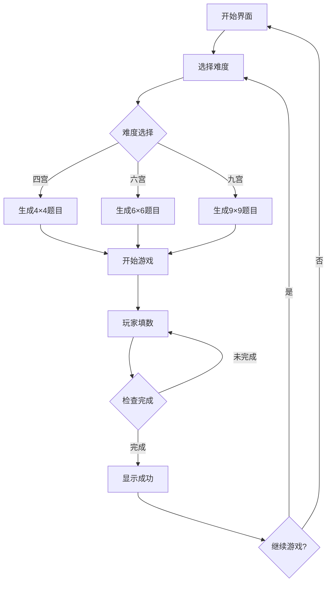

# 数独游戏 - 产品需求文档

## 1. 产品概述

一款融合东方禅意美学的数独益智游戏，支持四宫、六宫、九宫三种难度等级。游戏设计追求宁静专注的体验，让玩家在优雅的视觉环境中享受逻辑推理的乐趣。

### 产品定位
- **目标用户**：休闲益智游戏爱好者、各年龄段数独玩家
- **核心价值**：在精美的东方美学界面中提供流畅的数独解谜体验
- **市场差异化**：独特的禅意视觉风格，结合现代极简主义的交互设计

## 2. 核心功能

### 2.1 难度选择
| 难度等级 | 宫格规格 | 说明 |
|---------|---------|------|
| 入门 | 四宫格 (4×4) | 适合儿童和初学者，数字1-4 |
| 进阶 | 六宫格 (6×6) | 中等难度，数字1-6 |
| 高级 | 九宫格 (9×9) | 经典数独，数字1-9，完整挑战 |

### 2.2 游戏功能
1. **题目生成**：根据难度自动生成有效数独题目
2. **数字输入**：点击格子后通过数字键盘输入
3. **冲突检测**：实时高亮显示冲突数字
4. **计时功能**：记录解题用时
5. **答案验证**：一键检查当前填写是否正确
6. **重置游戏**：清除所有用户输入，恢复初始状态
7. **新游戏**：重新生成新题目

### 2.3 辅助功能
- **提示功能**：显示一个空格的建议答案
- **笔记模式**：切换到笔记状态，可标记可能值
- **撤销/重做**：支持操作历史回退

## 3. 核心流程

### 3.1 游戏主流程


### 3.2 交互流程
1. 用户选择难度等级
2. 系统生成随机的有效数独谜题
3. 用户点击格子选中
4. 用户通过数字键盘输入/删除数字
5. 系统实时验证并高亮冲突
6. 用户完成所有空格
7. 系统验证答案并显示结果

## 4. 用户界面设计

### 4.1 设计风格
**禅意极简 - 东方美学的现代诠释**
- 灵感来源：日本枯山水、传统和纸纹理、禅意留白
- 整体感觉：宁静、专注、优雅

### 4.2 色彩方案
| 用途 | 颜色 | 色值 |
|-----|------|------|
| 主色调 | 墨色 | #1a1a2e |
| 次要色 | 宣纸白 | #f5f0e8 |
| 强调色 | 朱砂红 | #c45c48 |
| 背景色 | 淡墨灰 | #e8e4dd |
| 文字色 | 墨黑 | #2d2d2d |
| 成功色 | 松石绿 | #4a7c59 |
| 冲突色 | 胭脂红 | #d64545 |

### 4.3 字体选择
- **标题字体**：Noto Serif SC（思源宋体）- 优雅的衬线体
- **数字字体**：DM Sans - 清晰的几何无衬线体
- **正文字体**：Noto Sans SC（思源黑体）- 现代中文黑体

### 4.4 布局结构
```
┌──────────────────────────────────────┐
│            标题区域                   │
│         "数独" + 难度选择             │
├──────────────────────────────────────┤
│                                      │
│           数独棋盘区域                 │
│         (居中, 自适应大小)             │
│                                      │
├──────────────────────────────────────┤
│           数字输入键盘                 │
│        (1-4 / 1-6 / 1-9)             │
├──────────────────────────────────────┤
│           功能按钮区域                 │
│      提示 | 笔记 | 撤销 | 验证        │
├──────────────────────────────────────┤
│           信息显示区域                 │
│         计时器 | 提示次数              │
└──────────────────────────────────────┘
```

### 4.5 视觉细节
- 棋盘使用柔和阴影营造层次感
- 宫格分隔线使用渐变增加深度
- 选中的格子有柔和的光晕效果
- 冲突数字使用醒目的红色高亮
- 输入数字使用墨色书写风格
- 整体背景带有微妙的和纸纹理
- 按钮使用圆润边角，带有微妙渐变

### 4.6 响应式设计
- **桌面端**：棋盘居中，最大宽度480px
- **平板端**：棋盘自适应，保持比例
- **移动端**：棋盘占满宽度，按钮放大便于触控

## 5. 技术实现

### 5.1 技术栈
- **前端框架**：React 18 + TypeScript
- **样式方案**：Tailwind CSS
- **构建工具**：Vite
- **状态管理**：React Hooks (useState, useReducer)

### 5.2 核心算法
1. **数独生成算法**：回溯法生成完整解，随机挖空形成谜题
2. **冲突检测**：检查行、列、宫内是否有重复数字
3. **完成验证**：所有空格填满且无冲突即为完成

### 5.3 数据结构
```typescript
interface SudokuCell {
  value: number | null;      // 当前值
  isFixed: boolean;          // 是否为题目初始数字
  isValid: boolean;          // 当前是否有效
  notes: number[];           // 笔记模式下的可能值
}

interface SudokuGame {
  grid: SudokuCell[][];      // 棋盘数据
  size: 4 | 6 | 9;           // 宫格大小
  difficulty: string;        // 难度等级
  elapsedTime: number;       // 用时（秒）
  hintsUsed: number;         // 已使用提示次数
}
```
