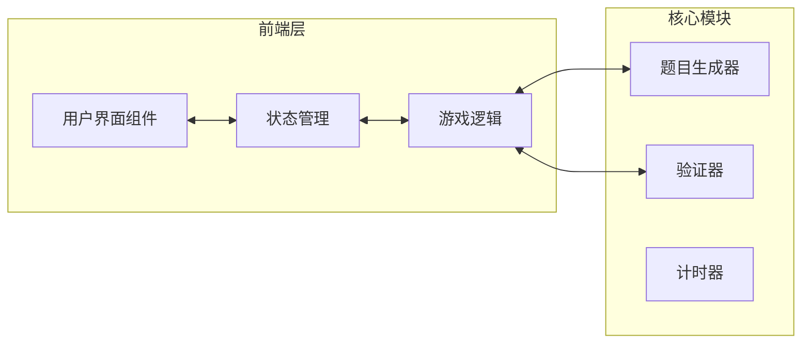

# 数独游戏 - 技术架构文档

## 1. 架构设计

### 1.1 系统架构图


### 1.2 目录结构
```
/workspace/sudoku/
├── index.html
├── package.json
├── vite.config.ts
├── tailwind.config.js
├── postcss.config.js
├── tsconfig.json
└── src/
    ├── main.tsx
    ├── App.tsx
    ├── index.css
    ├── components/
    │   ├── Header.tsx
    │   ├── DifficultySelector.tsx
    │   ├── SudokuBoard.tsx
    │   ├── Cell.tsx
    │   ├── NumberPad.tsx
    │   ├── ControlButtons.tsx
    │   ├── Timer.tsx
    │   └── SuccessModal.tsx
    ├── hooks/
    │   ├── useSudoku.ts
    │   └── useTimer.ts
    ├── utils/
    │   ├── generator.ts
    │   ├── validator.ts
    │   └── helpers.ts
    └── types/
        └── index.ts
```

## 2. 技术选型

| 技术 | 版本 | 用途 |
|------|------|------|
| React | 18.x | UI框架 |
| TypeScript | 5.x | 类型安全 |
| Tailwind CSS | 3.x | 样式方案 |
| Vite | 5.x | 构建工具 |

## 3. 组件设计

### 3.1 组件层次
```
App
├── Header (标题 + 难度选择)
├── SudokuBoard (棋盘容器)
│   └── Cell × N (单个格子)
├── NumberPad (数字键盘)
├── ControlButtons (功能按钮)
│   ├── 提示按钮
│   ├── 笔记按钮
│   ├── 撤销按钮
│   ├── 重做按钮
│   ├── 验证按钮
│   └── 新游戏按钮
├── Timer (计时器)
└── SuccessModal (成功弹窗)
```

### 3.2 组件接口

#### DifficultySelector
```typescript
interface DifficultySelectorProps {
  current: 4 | 6 | 9;
  onChange: (difficulty: 4 | 6 | 9) => void;
}
```

#### SudokuBoard
```typescript
interface SudokuBoardProps {
  grid: SudokuCell[][];
  selectedCell: { row: number; col: number } | null;
  onCellClick: (row: number, col: number) => void;
  size: 4 | 6 | 9;
}
```

#### Cell
```typescript
interface CellProps {
  cell: SudokuCell;
  isSelected: boolean;
  isRelated: boolean;
  size: 4 | 6 | 9;
  onClick: () => void;
}
```

#### NumberPad
```typescript
interface NumberPadProps {
  maxNumber: number;
  onNumberClick: (num: number) => void;
  onDeleteClick: () => void;
}
```

## 4. 核心算法实现

### 4.1 数独生成算法
```
1. 创建一个空的 N×N 网格
2. 使用回溯法填充数字 1-N
3. 确保每行、每列、每个宫内无重复
4. 完成后随机挖除部分格子形成谜题
5. 挖空数量根据难度决定：
   - 四宫格：挖空 6-8 个
   - 六宫格：挖空 16-20 个
   - 九宫格：挖空 35-45 个
```

### 4.2 冲突检测算法
```
对于每个已填数字，检查：
1. 同行是否有重复
2. 同列是否有重复
3. 同宫是否有重复

时间复杂度：O(N²) per cell
```

### 4.3 验证逻辑
```
完成条件：
1. 所有空格都已填满
2. 无任何冲突存在

返回：boolean
```

## 5. 状态管理

### 5.1 游戏状态
```typescript
interface GameState {
  grid: SudokuCell[][];           // 当前棋盘
  solution: number[][];           // 完整解
  selectedCell: CellPosition;    // 选中位置
  size: 4 | 6 | 9;               // 宫格大小
  difficulty: 'easy' | 'medium' | 'hard';
  isNoteMode: boolean;           // 笔记模式
  elapsedTime: number;           // 已用时间
  hintsUsed: number;             // 已用提示
  history: HistoryEntry[];        // 操作历史
  historyIndex: number;           // 历史指针
  isComplete: boolean;           // 是否完成
}
```

### 5.2 操作历史
```typescript
interface HistoryEntry {
  type: 'set' | 'clear' | 'note';
  row: number;
  col: number;
  prevValue: number | null;
  newValue: number | null;
  prevNotes: number[];
  newNotes: number[];
}
```

## 6. 样式规范

### 6.1 颜色变量
```css
:root {
  --color-primary: #1a1a2e;
  --color-secondary: #f5f0e8;
  --color-accent: #c45c48;
  --color-background: #e8e4dd;
  --color-text: #2d2d2d;
  --color-success: #4a7c59;
  --color-error: #d64545;
  --color-fixed: #1a1a2e;
  --color-user: #4a5568;
  --color-note: #718096;
}
```

### 6.2 动画效果
- 格子选中：box-shadow 渐变过渡 200ms
- 数字输入：scale 弹跳效果 150ms
- 冲突高亮：background-color 脉冲动画
- 成功弹窗：fade + scale 组合动画
- 计时器：数字翻转效果

### 6.3 响应式断点
```
sm:  640px  - 手机横屏
md:  768px  - 平板竖屏
lg:  1024px - 平板横屏 / 小桌面
xl:  1280px - 桌面
```

## 7. 性能优化

### 7.1 渲染优化
- 使用 React.memo 缓存 Cell 组件
- 避免不必要的状态更新
- 使用 useCallback 缓存事件处理器

### 7.2 计算优化
- 冲突检测使用 Set 数据结构
- 验证算法按需触发，非实时检测
